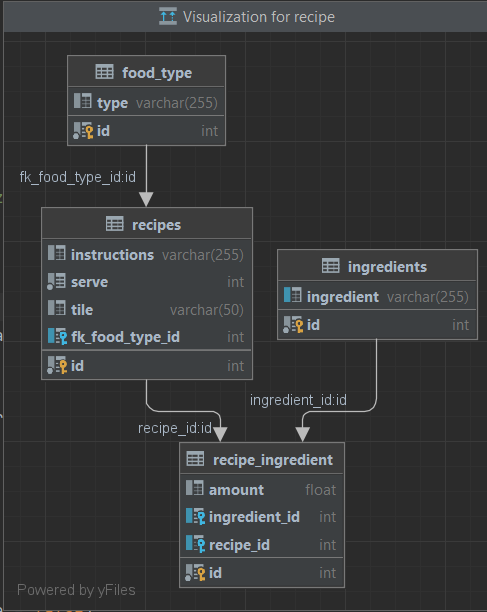

# recipe

I have developed Based on 3 layer: Controller, Service and Dao(Repository).
Into data model I have 4 table (Recipe , Ingredient, FoodType, RecipeIngredient) these have one-to-many relationship.
Into service layer I have written business the recipe project such as validation, call repository and so on.
Into Recipe Controller I have written 5 Rest Api (CRUD and dynamic search) 
I use [mysql] db for real action
I use [h2] db for test case (unit test, integration test)

### DataModel

## How to Run
* Execute tests:

  **mvn clean install**

* starting Application:

  **docker-compose up**

you can call five Rest Api for shopping Cart :

* [If you want to create a recipe]
    * [Create a recipe](http://localhost:8080/api/recipes)

* [Secondly, if you want to have a product into shopping cart you should call add a product]
    * [Add a product to the shopping cart](http://localhost:8080/api/carts/1/products)

* [If you want to get the recipes]
    * [Get the shopping cart](http://localhost:8080/api/recipes)

* [If you want to get a product in the shopping cart]
    * [Get a product in the shopping cart](http://localhost:8080/api/carts/1/products?productId=1)

* [If you want to delete a product from the cart]
    * [Delete a product from the cart](http://localhost:8080/api/carts/1/products?productId=1)

### Tools & Technologies

* [Java 11]
* [Spring boot]
* [Maven]
* [Docker]
* [Lombok]
* [Postgres]
* [Swagger]
* [JUnit 5]
* [Mockito]
* [H2]
* [Mapstruct]
* [liquibase]

### Guides
Follow the link below to find the proper documentation:
* [API Swagger UI](http://localhost:8080/swagger-ui.html#/)

### Author
This project has been implemented by **Abbas Payami** for project for ABN AMRO Code Challenge
[Contact me](payami2013@gmail.com)